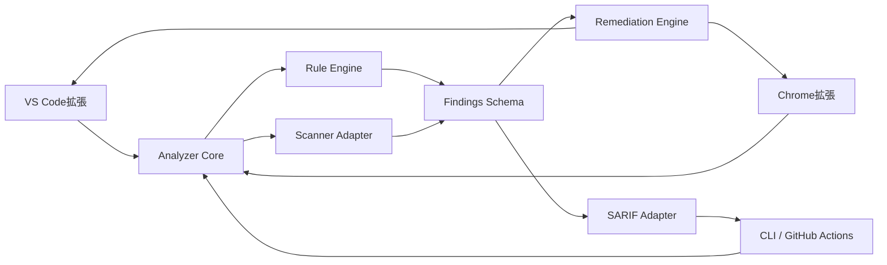
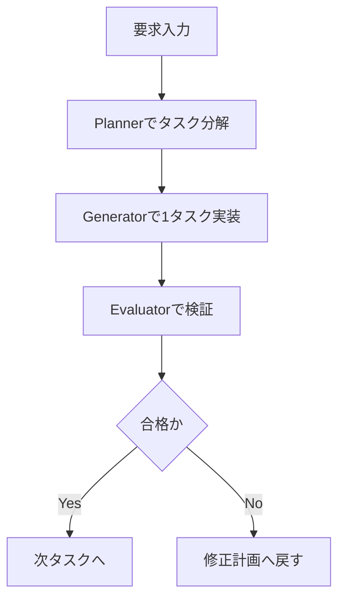
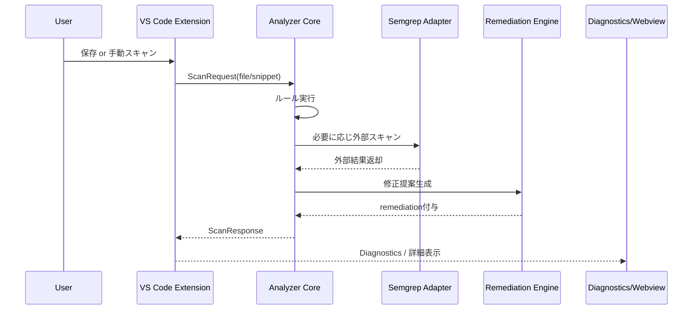
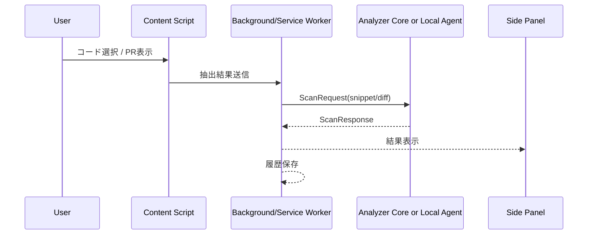
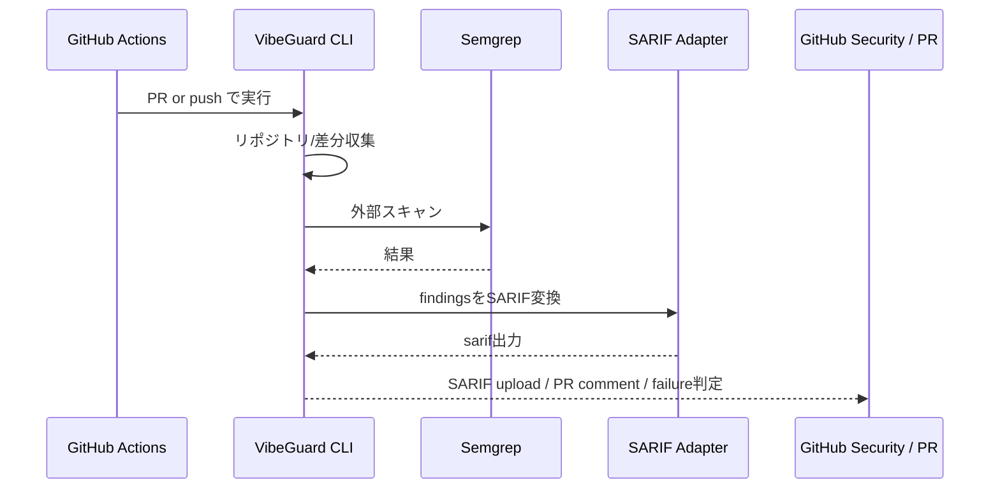

# VibeGuard 詳細設計書（Codex対応版）

- **題名**：AI生成コードのセキュリティ診断アプリケーション VibeGuard 詳細設計書
- **対象形態**：GitHubリポジトリ管理 / VS Code拡張 / Chrome拡張 / CLI / Codex実装ハーネス
- **版数**：v0.2
- **作成目的**：実装開始前の全体設計整理、MVP開発の基準書、Codexベースの実装運用ルールの明確化
- **想定読者**：開発担当者、設計レビュー担当者、セキュリティレビュー担当者、将来の保守担当者

---

## 1. 文書の位置づけ

本書は、VibeGuard の**全体設計書兼詳細設計書**である。

VibeGuard は、AI生成コードを含むソースコードに対して、**開発中**・**閲覧中**・**マージ前**の3段階でセキュリティ診断を実施する統合基盤である。

本書では以下を定義する。

1. システムの目的とスコープ
2. 採用アーキテクチャ
3. 機能要件・非機能要件
4. モジュール構成と責務分担
5. データモデルとインターフェース
6. VS Code拡張 / Chrome拡張 / GitHub連携の動作詳細
7. セキュリティ・テスト・運用方針
8. Codex による実装運用のためのハーネス設計

---

## 2. システム概要

### 2.1 背景

近年、生成AIを利用してコードを作成する開発スタイルが一般化している。
この方式では、短時間で動作するコードを得やすい反面、開発者がコードの本質的な危険性を十分に確認しないまま採用してしまうリスクがある。

特に、以下のような問題が起こりやすい。

- 入力値検証の欠落
- 危険APIの安易な使用
- 例外処理の握りつぶし
- ハードコードされた秘密情報の混入
- 認証・認可処理の簡略化
- SQL Injection / XSS / Command Injection 等の脆弱な実装
- 「とりあえず動く」ことを優先した暫定コードの放置
- TODO コメントだけが存在し、安全処理の実装が未完了の状態
- テスト用のバイパス設定やダミー鍵が本番コードへ残る事象

このようなコードはローカル環境では問題なく見えても、本番環境では重大なインシデントの原因となる。

### 2.2 解決したい課題

VibeGuard は、AI生成コードに特有の危険性を含め、コードの安全性を**3つのタイミング**で検査する。

- **作成時**：VS Code拡張により即時検査する
- **閲覧時**：Chrome拡張によりWeb上のコード断片やPR差分を検査する
- **マージ前**：GitHub Actionsによりリポジトリ全体を再検査する

### 2.3 システムの目的

VibeGuard の目的は次の3点である。

1. AI生成コードを含むソースコードの危険箇所を自動検出する
2. 危険理由と修正案を提示し、開発者の判断を支援する
3. GitHub上で検査結果を一元管理し、危険コードのマージを抑止する

---

## 3. システムの位置づけ

### 3.1 システムの性質

本システムは単一のWebアプリではない。
VibeGuard は、複数の利用導線を持つ**統合診断基盤**である。

利用導線は以下の4系統で構成する。

1. **VS Code拡張**：開発中のコードを即時検査する
2. **Chrome拡張**：ブラウザ上のコード断片やGitHub PR差分を検査する
3. **CLI / GitHub Actions**：リポジトリ全体を継続的に検査する
4. **Codex実装ハーネス**：マルチエージェントで実装・検証・改善を回しやすくする

### 3.2 提供価値

VibeGuard は単なる警告表示ツールではなく、以下の価値を提供する。

- 同一の解析コアに基づく**一貫した判定基準**
- 危険箇所の検出だけでなく、**なぜ危険か**と**どう直すべきか**の提示
- ローカル作業からCIまで一貫した**セキュリティゲート**
- AI生成コードに特有の雑な実装傾向への対応
- 将来の拡張（ルール追加・言語追加・組織ポリシー）を前提とした構造

---

## 4. 対象ユーザー

### 4.1 主対象

- 生成AIを使ってコードを書く個人開発者
- GitHubでレビュー運用をしているチーム開発者
- セキュリティ専門ではないが、安全性確認をしたい実装担当者
- AI生成コードの品質管理をしたいプロジェクト管理者
- セキュリティレビューの初期スクリーニングを自動化したい小規模チーム

### 4.2 想定利用シーン

- AIが出力したコードをそのまま貼る前に検査したい
- 保存前後で危険な記述がないか確認したい
- PR差分に危険コードがないかブラウザ上で見たい
- main ブランチに危険な実装を入れたくない
- 修正案まで含めて短時間で確認したい
- セキュリティの専門知識が薄いメンバーでも最低限の地雷を避けたい

---

## 5. スコープ

### 5.1 対象範囲

本システムが対象とするのは以下である。

- ソースコードファイル
- ブラウザ上に表示されたコード断片
- GitHub上の差分
- AI生成コードと思われる一時コード
- リポジトリ全体のセキュリティ診断結果管理
- ルールベース診断と静的解析ツール結果の統合

### 5.2 非対象

初期MVPでは以下は対象外とする。

- 実行時の動的解析
- 本格的なDAST
- コンテナイメージ監査
- クラウド設定監査
- 完全なSBOM管理
- SSOや組織横断の高度な権限統制
- 大規模商用SAST製品並みの全言語深度解析
- 大規模な自動修正エンジン

### 5.3 MVPで守るべき境界

MVPでは「何でも検出する」ことを目指さない。
最優先は、**AI生成コードで起こりやすく、かつ事故に直結しやすいパターンを早く見つけること**である。

そのため、MVPの評価軸は次の通りとする。

- 危険度の高いパターンを漏らさず拾えるか
- 開発者が使い続けられる応答速度か
- 結果が分かりやすく、修正判断につながるか
- ローカル・ブラウザ・CIの判定が大きくズレないか

---

## 6. 開発方針

### 6.1 基本方針

各クライアントごとに別々の判定ロジックを持つのではなく、**共通解析エンジン**を中核に据える。
これにより、VS Code拡張・Chrome拡張・GitHub CIで判定基準がズレることを防ぐ。

### 6.2 採用アーキテクチャ

- **Monorepo + Shared Core** を採用する
- 解析ロジックは共通パッケージへ集約する
- UI層と解析層を明確に分離する
- 結果スキーマを統一し、出力形式はアダプタで吸収する
- ルール追加を小さな単位で繰り返せる構造にする

### 6.3 外部スキャナの位置づけ

VibeGuard は自前ルールだけでなく、外部静的解析ツールも補助的に組み込む。
MVP時点では **Semgrep** を主要な外部スキャナ候補とし、一次または二次スキャンに利用する。

### 6.4 実装運用方針（Codex対応）

本プロジェクトでは、Codex を利用した実装補助を前提とし、以下の3役を分離する。

- **Planner**：要件を実装可能な計画へ分解する
- **Generator**：計画された1タスクを最小変更で実装する
- **Evaluator**：テスト・動作確認・ブラウザ確認を行う

これにより、設計・実装・検証を1つのプロンプトに混在させず、責務を分離して品質を上げる。

---

## 7. 全体アーキテクチャ

### 7.1 全体像



### 7.2 論理レイヤ構成

#### Presentation Layer

- VS Code UI
- Chrome UI
- GitHub PRコメント
- CLIコンソール出力

#### Application Layer

- スキャン要求の受付
- スキャン対象種別の判定
- 実行モード選択（fast / standard / deep）
- 外部スキャナ利用有無の制御
- 重要度・信頼度の調整

#### Domain Layer

- Finding
- Rule
- Remediation
- ScanContext
- Severity / Confidence

#### Infrastructure Layer

- Semgrep実行
- SARIF出力
- GitHub Actions連携
- ローカル設定・履歴保存
- Chrome storage / VS Code storage 連携

### 7.3 設計上の最重要原則

VibeGuard で最も重要な設計原則は次の通りである。

1. **判定ロジックは1か所に集約する**
2. **出力形式はアダプタで分離する**
3. **危険検出と修正提案は別責務にする**
4. **UIは軽く、解析コアは独立して再利用可能にする**
5. **誤検知を減らすために confidence を持つ**

---

## 8. リポジトリ構成設計

### 8.1 推奨モノレポ構成

```text
VibeGuard/
├─ AGENTS.md
├─ package.json
├─ pnpm-workspace.yaml
├─ turbo.json
├─ .codex/
│  ├─ config.toml
│  └─ agents/
│     ├─ planner.toml
│     ├─ generator.toml
│     └─ evaluator.toml
├─ .github/
│  └─ workflows/
│     ├─ ci.yml
│     ├─ scan-pr.yml
│     └─ scan-main.yml
├─ apps/
│  ├─ cli/
│  └─ local-agent/
├─ extensions/
│  ├─ vscode/
│  └─ chrome/
├─ packages/
│  ├─ analyzer-core/
│  ├─ rules/
│  ├─ findings-schema/
│  ├─ remediation-engine/
│  ├─ sarif-adapter/
│  ├─ scanner-semgrep/
│  ├─ config/
│  └─ shared/
├─ docs/
│  ├─ architecture/
│  ├─ rules/
│  └─ runbooks/
└─ samples/
   ├─ vulnerable/
   └─ safe/
```

### 8.2 各ディレクトリの責務

| パス | 役割 |
|---|---|
| `AGENTS.md` | Codex向けプロジェクト全体ルール |
| `.codex/config.toml` | Codexのプロジェクト設定、MCP設定 |
| `.codex/agents/` | Planner / Generator / Evaluator の役割定義 |
| `packages/analyzer-core` | 共通診断エンジン |
| `packages/rules` | ルール定義、ルール実行ロジック |
| `packages/findings-schema` | 検出結果の共通データ構造 |
| `packages/remediation-engine` | 修正案生成ロジック |
| `packages/sarif-adapter` | SARIF変換 |
| `packages/scanner-semgrep` | Semgrep統合アダプタ |
| `extensions/vscode` | VS Code拡張本体 |
| `extensions/chrome` | Chrome拡張本体 |
| `apps/cli` | ローカル実行・CI向けCLI |
| `apps/local-agent` | Chrome補助ローカルエージェント（任意） |
| `.github/workflows` | CI/CD・スキャン自動化 |
| `samples/` | テスト用サンプルコード |
| `docs/` | 設計・運用・ルールドキュメント |

---

## 9. Codex 実装ハーネス設計

### 9.1 目的

Codex による実装を安定させるため、プロジェクト内で以下を明文化する。

- 何を作るべきか
- どの順序で作るべきか
- どの粒度で変更すべきか
- どう検証したら完了とみなすか

### 9.2 AGENTS.md の役割

`AGENTS.md` には、Codex がプロジェクトルートで必ず参照すべき運用ルールを記載する。

定義内容の例は以下とする。

- プロジェクトの目的
- デフォルトの開発ループ
- Planner / Generator / Evaluator の使い分け
- Definition of Done
- モノレポ前提の開発ルール
- テストとレポートの最低基準

### 9.3 Planner / Generator / Evaluator の責務

#### Planner

- 曖昧な要件を実装可能なタスクに分解する
- スコープと非スコープを切り分ける
- 受け入れ条件を明確化する
- 実装順序を提案する

#### Generator

- Planner が切った1タスクだけを実装する
- 変更範囲を最小化する
- 既存アーキテクチャへ整合するよう実装する
- 必要なテストのみを追加・修正する

#### Evaluator

- 関連テストを実行する
- 必要に応じてUI動作を検証する
- PASS / PASS WITH GAPS / FAIL で判定する
- 未検証箇所と残課題を明示する

### 9.4 Codex運用ルール

- 非自明な機能追加は必ず Planner を通す
- 一度に大きな機能を実装しない
- 1タスク実装ごとに Evaluator で検証する
- UI変更がある場合はブラウザ検証を行う
- 検証未実施の状態で「完成」としない

### 9.5 Codex利用時の標準フロー



---

## 10. 機能要件

### 10.1 コア診断機能

#### 機能一覧

- コード文字列またはファイルを入力として受け取る
- 対象言語を推定または明示指定する
- ルールベース診断を実行する
- 外部静的解析ツールを必要に応じて実行する
- 結果を共通スキーマへ変換する
- 重要度と信頼度を付与する
- 修正提案を生成する
- UIまたはCI向け形式で返す

#### 入力パターン

- 単一ファイル
- 選択テキスト
- 差分
- リポジトリ全体

#### 出力パターン

- JSON
- SARIF
- Diagnostics
- Webview / Side Panel 表示用データ
- PRコメント用要約

### 10.2 VS Code拡張機能

- 保存時スキャン
- 手動スキャン
- 選択範囲スキャン
- ワークスペース差分スキャン
- 問題箇所に Diagnostics 表示
- Code Action による修正提案表示
- Findings サイドバー表示
- 詳細パネル表示
- SARIF / JSON 出力

### 10.3 Chrome拡張機能

- ページ上のコードブロック抽出
- 選択テキストスキャン
- GitHub PR差分抽出
- サイドパネル表示
- 危険箇所一覧表示
- 「この差分だけ再スキャン」
- ローカル保存された履歴表示

### 10.4 GitHub連携機能

- PRトリガースキャン
- pushトリガースキャン
- SARIFアップロード
- PRコメント投稿
- 危険度に応じた失敗判定
- Security タブへの結果集約

---

## 11. 非機能要件

### 11.1 性能要件

| 項目 | 目標 |
|---|---|
| 単一ファイルの軽量スキャン | 3秒以内 |
| 選択範囲スキャン | 1秒以内 |
| PR差分スキャン | 10秒以内 |
| 中規模リポジトリ全体スキャン | 5分以内 |

### 11.2 可用性要件

- ローカル利用時はオフラインでも最低限動作する
- 外部連携失敗時も自前ルール診断は継続する
- Semgrep 等の外部ツールが利用不能でも最低限の診断が継続する

### 11.3 拡張性要件

- 新しいルール追加が容易である
- 新しい言語対応を追加しやすい
- 修正提案生成ロジックを差し替え可能にする
- 新しい出力形式をアダプタ追加で対応可能にする

### 11.4 保守性要件

- 解析ロジックとUIを分離する
- 結果スキーマを統一する
- ルールはファイル単位で独立管理する
- クライアントごとの分岐を analyzer-core に持ち込みすぎない

### 11.5 セキュリティ要件

- ローカルコードを無断で外部送信しない
- ユーザーが送信可否を選択できる
- 秘密情報の抽出結果はマスキング表示する
- ログにコード全文を不必要に残さない

---

## 12. モジュール設計

## 12.1 analyzer-core

### 役割

共通の診断エンジンとして、入力受付から結果統合までを担当する。

### 主な責務

- 対象コードの正規化
- コメント・差分・ファイルメタ情報の保持
- 言語判定
- 実行対象ルール絞り込み
- 外部スキャナの起動判断
- 並列実行制御
- findings 配列の生成
- summary / metadata の出力

### 入力

```ts
interface ScanRequest {
  targetType: 'file' | 'snippet' | 'diff' | 'repo';
  content?: string;
  filePath?: string;
  language?: string;
  mode: 'fast' | 'standard' | 'deep';
  includeExternalScanners?: boolean;
  includeRemediation?: boolean;
  context?: ScanContext;
}
```

### 出力

```ts
interface ScanResponse {
  summary: ScanSummary;
  findings: Finding[];
  executionTimeMs: number;
  engineVersions: Record<string, string>;
  generatedAt: string;
}
```

### 内部サブモジュール案

- `language-detector`
- `scan-orchestrator`
- `rule-runner`
- `external-scanner-runner`
- `result-merger`
- `severity-calculator`
- `confidence-calculator`

## 12.2 rules

### 役割

個々のセキュリティルールを管理する。

### ルールの種類

- 危険APIパターン
- 入力検証欠落
- 認証 / 認可欠落
- 秘密情報混入
- AI生成コード固有ヒューリスティクス
- フレームワーク別ルール
- 組織独自ポリシールール

### ルール定義項目

```ts
interface RuleDefinition {
  ruleId: string;
  name: string;
  description: string;
  language: string[];
  category: string;
  severityDefault: 'critical' | 'high' | 'medium' | 'low' | 'info';
  cwe?: string[];
  owasp?: string[];
  matcher: MatcherDefinition;
  evidenceExtractor?: EvidenceExtractorDefinition;
  remediationTemplate?: string;
  tags?: string[];
}
```

### 実装方針

- 1ルール1ファイルを原則とする
- ルール定義とテストケースを近い位置に置く
- ルール追加時に破壊的変更が波及しないようにする
- language / framework / category 単位でディレクトリ整理する

## 12.3 findings-schema

### 役割

検出結果の標準データ構造を定義する。

### 想定スキーマ

```ts
interface Finding {
  findingId: string;
  ruleId: string;
  title: string;
  description: string;
  severity: 'critical' | 'high' | 'medium' | 'low' | 'info';
  confidence: 'high' | 'medium' | 'low';
  category: string;
  language?: string;
  filePath?: string;
  startLine?: number;
  endLine?: number;
  snippet?: string;
  evidence?: string[];
  remediation?: Remediation;
  references?: string[];
  sourceEngine: 'core-rule' | 'semgrep' | 'external';
  tags?: string[];
}
```

### 設計上の注意

- UIに必要な情報とCIに必要な情報を共存させる
- ただしSARIF固有項目は持ち込まず、中立スキーマに保つ
- 秘密情報を生で持ちすぎない

## 12.4 sarif-adapter

### 役割

共通 finding を SARIF へ変換する。

### 利用目的

- GitHub code scanning 連携
- ダウンロード用レポート
- 外部ツール統合

### 実装方針

- Rule と Result の対応を明確にする
- filePath / region / message を必ず設定する
- severity を SARIF レベルへマッピングする
- 参照URLや help テキストを持てるようにする

## 12.5 remediation-engine

### 役割

検出された問題に対して修正案を提示する。

### 生成内容

- なぜ危険か
- どう悪用されるか
- 最低限の修正方針
- 推奨修正コード例
- 追加確認事項

### 注意点

- 修正案は必ずしも自動適用しない
- MVPでは「提案表示」が中心である
- 自動修正は将来拡張とし、初期は限定的に扱う

## 12.6 scanner-semgrep

### 役割

Semgrep を呼び出し、結果を共通形式へ変換する。

### 実行タイミング

- VS Code：手動または保存時
- CLI：明示実行
- GitHub Actions：PR時 / push時

### 実装上の注意

- 外部コマンド失敗時に analyzer-core 全体を止めない
- 標準出力 / 標準エラーを分離管理する
- 実行モードに応じてスキャン深度を切り替える

---

## 13. 診断ルール設計

### 13.1 初期対応カテゴリ

#### 入力系

- SQL Injection
- XSS
- SSRF
- Command Injection
- Path Traversal

#### 認証・認可系

- 認証スキップ
- role 判定漏れ
- debug bypass
- token 未検証

#### データ保護系

- ハードコード秘密情報
- 平文保存
- 暗号利用不備
- TLS 検証無効化

#### 実装品質系

- 例外握りつぶし
- fail-open
- 危険なデシリアライズ
- 危険な eval 系

#### AI生成コード固有系

- TODO で未完了の安全処理
- コメントだけで実装未完
- サンプルコード流用痕跡
- テスト用の危険設定残存
- ダミー鍵や固定トークン残存

### 13.2 重要度設計

| Severity | 想定内容 |
|---|---|
| Critical | 認証回避、明白なRCE、実鍵埋め込み、本番利用想定の重大脆弱構成 |
| High | SQLi、XSS、Command Injection、権限不備、機微データ漏えいの可能性大 |
| Medium | 入力検証不足、エラーハンドリング不備、危険API使用だが即悪用とは限らないもの |
| Low | ベストプラクティス逸脱、将来事故につながる可能性がある実装 |
| Info | 注意喚起、改善余地、AI生成コードらしさの参考指摘 |

### 13.3 Confidence 設計

誤検知を制御するために confidence を導入する。

| Confidence | 意味 |
|---|---|
| High | 明示的パターン一致、文脈上も危険と判断しやすい |
| Medium | パターン一致だが安全文脈の可能性あり |
| Low | ヒューリスティクス中心で要人手確認 |

### 13.4 suppress 設計

将来的には以下の suppress を導入する。

- 行コメントによる suppress
- ファイルパス単位の suppress
- ruleId 単位の suppress
- 一時 suppress と恒久 suppress の区別

---

## 14. データフロー設計

### 14.1 VS Codeからの流れ



### 14.2 Chromeからの流れ



### 14.3 GitHub CIの流れ



---

## 15. API / インターフェース設計

### 15.1 共通 Scan API

#### Request

```json
{
  "targetType": "file | snippet | diff | repo",
  "content": "string",
  "filePath": "string",
  "language": "string",
  "mode": "fast | standard | deep",
  "includeExternalScanners": true,
  "includeRemediation": true
}
```

#### Response

```json
{
  "summary": {
    "critical": 0,
    "high": 0,
    "medium": 0,
    "low": 0,
    "info": 0,
    "total": 0
  },
  "findings": [],
  "executionTimeMs": 0,
  "engineVersions": {
    "core": "0.1.0"
  },
  "generatedAt": "2026-04-20T00:00:00Z"
}
```

### 15.2 Local Agent API（任意）

Chrome拡張はブラウザ制約上、リポジトリ全体解析には向かないため、必要に応じてローカル補助プロセスを置く。
初期MVPでは省略可能だが、拡張余地として設計だけ用意する。

#### Endpoint案

- `POST /scan/snippet`
- `POST /scan/file`
- `POST /scan/diff`
- `POST /export/sarif`

---

## 16. 画面・UX設計

## 16.1 VS Code拡張 UI

### 画面構成

- エディタ上の Diagnostics
- サイドバー「VibeGuard Findings」
- 詳細 Webview
- ステータスバー

### 操作

- 右クリック → `VibeGuard: Scan Selection`
- コマンドパレット → `VibeGuard: Scan Current File`
- 保存時自動実行
- 問題一覧クリックで該当箇所へ移動

### 表示項目

- 重要度
- 問題名
- 説明
- 該当行
- 修正方針
- 推奨例
- 参考カテゴリ
- sourceEngine
- confidence

### UX方針

- 保存のたびに重すぎる処理をしない
- 詳細は Webview に逃がし、エディタは邪魔しすぎない
- 同じ問題の多重表示を避ける
- 修正案は「提案」として見せ、断定しすぎない

## 16.2 Chrome拡張 UI

### 画面構成

- ツールバーアイコン
- ポップアップ
- サイドパネル
- ページ上ハイライト

### 操作

- 選択範囲をスキャン
- 現在のコードブロックをスキャン
- GitHub PR差分をスキャン
- 結果を履歴保存

### 表示項目

- 対象ページURL
- スキャン対象種別
- 重大度別件数
- 問題一覧
- 詳細説明
- 修正案
- 再スキャンボタン

### UX方針

- GitHubページでは差分単位で対象を絞る
- ページ全体から無理に抽出しすぎず、ユーザー主導のスキャン導線を残す
- 結果はサイドパネル中心に整理して見せる

---

## 17. GitHub連携設計

### 17.1 ワークフロー

#### PR時

- 差分中心の軽量スキャン
- Critical / High 検出で失敗
- PRコメントで要約表示

#### main push時

- 全体スキャン
- SARIFアップロード
- Securityタブ反映

### 17.2 判定ルール

| Severity | CI判定 |
|---|---|
| Critical | 即失敗 |
| High | 失敗 |
| Medium | 警告 |
| Low | 情報提示 |
| Info | 参考表示 |

### 17.3 PRコメント例に含める項目

- 重大度別件数
- 新規検出件数
- 最重要3件
- 対象ファイル一覧
- SARIF / 詳細結果へのリンク

### 17.4 CodeQLとの共存方針

- VibeGuard は AI生成コード特有の危険パターンや運用上の雑な実装を補う
- CodeQL は既存のコード解析資産として併用する
- 両者の役割を競合ではなく補完関係として整理する

---

## 18. 保存データ設計

### 18.1 ローカル保存

#### VS Code

- ユーザー設定
- 直近スキャン履歴
- 除外ルール
- 重大度しきい値

#### Chrome

- 最近の診断履歴
- ページ別結果
- ユーザー設定
- 通知設定

### 18.2 GitHub側保存

- SARIF
- code scanning alerts
- CIログ
- PRコメント履歴

### 18.3 保存時の注意

- コード全文を不要に保存しない
- snippet は最小限とする
- 秘密情報らしき値はマスキングして保持する

---

## 19. セキュリティ設計

### 19.1 基本原則

- ソースコードはデフォルトでローカル解析
- 外部送信はオプトイン
- 機密値はマスキング表示
- ログにコード全文を残しすぎない
- 拡張機能権限を最小化する

### 19.2 Chrome拡張の注意

- 取得対象を必要最小限に絞る
- GitHubページ専用抽出ロジックと一般ページ抽出ロジックを分離する
- content script と service worker の責務を分ける
- 履歴保存時にURLと結果の持ち方を慎重にする

### 19.3 GitHub運用の注意

- public / private リポジトリで運用方針を分ける
- PRコメントに機微コード全文を載せない
- SARIFに不要な秘密情報を含めない
- fork PRでの秘密値取り扱いに注意する

### 19.4 修正案表示の注意

- 提案は保証ではないと明記する
- 誤修正を避けるため、危険理由をセットで示す
- 自動修正は限定機能とし、人のレビューを前提とする

---

## 20. テスト設計

### 20.1 単体テスト

対象：

- ルール判定
- finding 生成
- severity 分類
- confidence 分類
- SARIF変換
- remediation 生成

### 20.2 結合テスト

対象：

- VS Code拡張 → analyzer-core
- Chrome拡張 → analyzer-core
- CLI → SARIF → GitHub想定出力
- analyzer-core → scanner-semgrep

### 20.3 E2Eテスト

シナリオ：

1. 危険コード貼り付けで VS Code 警告が出る
2. GitHub PR差分を Chrome拡張で読み、問題が出る
3. 同一差分をPRで流し、CIで fail する
4. SARIF が GitHub Securityタブへ反映される

### 20.4 ルール精度テスト

- 真陽性率
- 偽陽性率
- 言語別精度
- AI生成コードサンプルでの再現率

### 20.5 Codex実装向け検証設計

- Planner のタスク分解粒度が適切か確認する
- Generator が1タスク以上に逸脱していないか確認する
- Evaluator が未検証項目を正しく開示しているか確認する
- UI変更時に実ブラウザ検証が行われているか確認する

---

## 21. 開発フェーズ

### 21.1 Phase 1：MVP

対象：

- analyzer-core
- 基本ルール 20〜30個
- findings-schema
- SARIF出力
- CLI
- VS Code拡張最小版

完了条件：

- 単一ファイル診断可能
- Diagnostics表示可能
- JSON / SARIF 出力可能

### 21.2 Phase 2：GitHub連携

対象：

- GitHub Actions
- PRコメント
- fail 判定
- CodeQL 共存設計

完了条件：

- PRで自動スキャン
- SARIFアップロード成功
- 重大度判定でブロック可能

### 21.3 Phase 3：Chrome拡張

対象：

- コード抽出
- side panel
- GitHub PR差分スキャン
- 履歴保存

完了条件：

- GitHub差分から抽出して診断表示できる

### 21.4 Phase 4：高度化

対象：

- AI修正提案高度化
- 組織ポリシー
- 言語追加
- ダッシュボード

---

## 22. リスクと対策

### 22.1 偽陽性が多い

対策：

- confidence 導入
- suppress 機能
- rule tuning
- diff 中心表示

### 22.2 診断が遅い

対策：

- fast / standard / deep の3モード
- 保存時は軽量ルールのみ
- CIで深い解析を実施

### 22.3 Chrome拡張で取りづらいページがある

対策：

- 選択範囲スキャンを基本機能にする
- GitHub専用抽出ロジックを別実装する
- 必要に応じ local-agent 方式に切り替える

### 22.4 ユーザーが修正案を過信する

対策：

- 「提案であり保証ではない」と明記する
- なぜ危険かを必ず説明する
- 自動修正は限定提供とする

### 22.5 解析対象コードが機密

対策：

- ローカル完結を標準とする
- 外部送信 OFF を初期値にする
- 保存データを最小化する

### 22.6 ルールが増えて保守困難になる

対策：

- 1ルール1責務を守る
- ルールID体系を整理する
- テストケースとルールを対にして管理する
- category / language / framework で規律的に整理する

---

## 23. 運用方針

### 23.1 バージョン管理

- `main`：安定版
- `develop`：開発版
- `feature/*`：機能追加
- `rules/*`：ルール改善

### 23.2 リリース方針

- VS Code拡張は VSIX 配布または Marketplace 公開
- Chrome拡張はローカル配布後、必要に応じてストア申請
- CLI は npm package または GitHub Releases で配布

### 23.3 CI/CD

- lint
- unit test
- integration test
- sample scan
- package build
- SARIF validation

### 23.4 運用ドキュメント

将来、以下の runbook を `docs/runbooks/` に整備する。

- ルール追加手順
- Semgrep障害時対応
- SARIFアップロード失敗時対応
- Chrome拡張配布手順
- VS Code拡張公開手順
- 誤検知報告と改善手順

---

## 24. 将来拡張案

- 組織独自セキュリティポリシーのルール化
- AI生成コードであること自体の推定
- 依存パッケージ脆弱性との統合表示
- Secret scanning 強化
- GitHub Issue 自動作成
- Pull Request Review Bot
- 自動修正PR生成
- ルール学習支援
- 言語追加
- Webダッシュボード

---

## 25. 最終方針まとめ

VibeGuard は、AI生成コードの安全性を、**開発中・閲覧中・マージ前**の3段階で確認するための統合診断基盤である。

設計上もっとも重要なのは、**VS Code拡張、Chrome拡張、GitHub CIのすべてが同じ解析コアを使うこと**である。

これにより、

- 開発者の手元では即時警告
- ブラウザ上では差分・断片チェック
- GitHubでは最終的なゲート管理

という流れを実現できる。

さらに、Codex 対応の実装ハーネスを導入することで、

- 要件整理
- タスク分解
- 最小実装
- 検証

を明示的に分離し、実装のばらつきを抑えやすくする。

VibeGuard のMVPでは、「危険なAI生成コードを早く、分かりやすく、現場で止める」ことを最優先とする。
そのうえで、ルール追加・言語追加・組織運用へ段階的に拡張できる構造を採用する。
