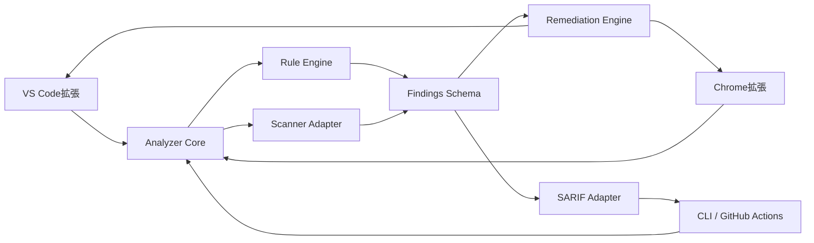
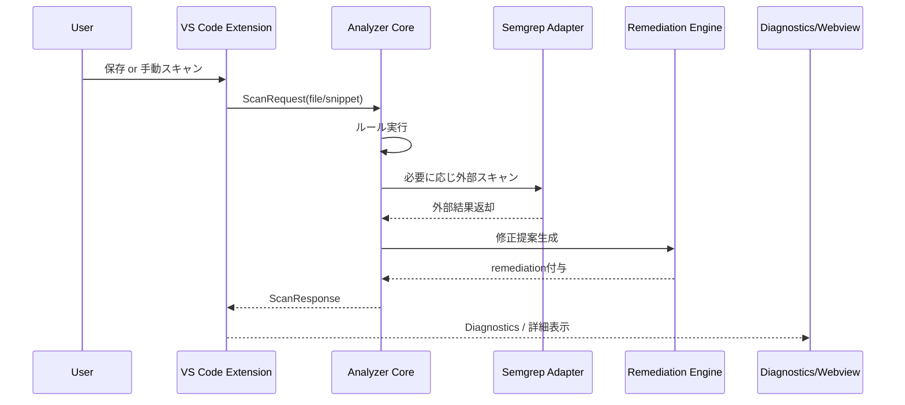
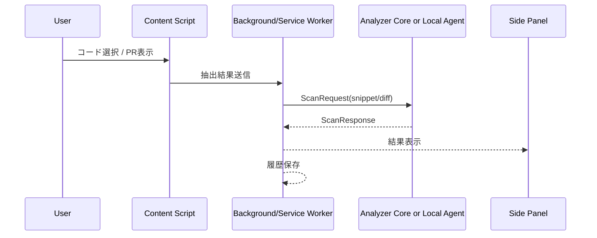
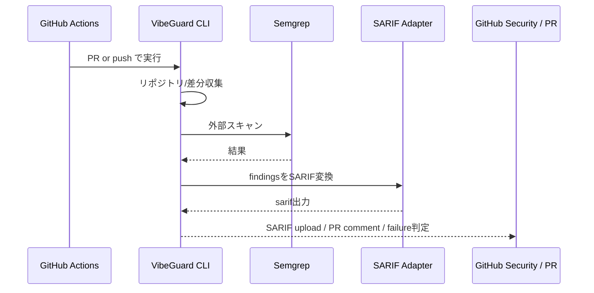

# VibeGuard 詳細設計書

- **題名**：AI生成コードのセキュリティ診断アプリケーション VibeGuard 詳細設計書
- **対象形態**：GitHubリポジトリ管理 / VS Code拡張 / Chrome拡張 / CLI
- **版数**：v0.2
- **作成目的**：実装開始前の全体設計整理、MVP開発の基準書
- **想定読者**：開発担当者、設計レビュー担当者、セキュリティレビュー担当者、将来の保守担当者

> **実装追記（engine 0.2.1・2026-07-21）**：本設計が「言語追加を前提とした構造」（§後述）で想定した拡張として、
> **C/C++/Arduino の組込みコード層**を実装した。`.ino`/`.hh`/`.cxx`/`.ipp` 拡張子と、`#ifdef` 分岐をまたぐ
> 危険コードを拾うためのプリプロセッサ正規化面（N_pp）を追加し、`VG-MEM`（メモリ）/`VG-EMB`（AI 生成組込み固有）/
> `VG-RTOS`（割込み・並行）の3系統・計19ルールを新設。**tree-sitter 等のパーサ依存は入れず**（4チャネル一致と
> 0依存の維持のため）、`extractBlockAfter` による字句レベルのブロック抽出で ISR 本体等の構造ルールを実現している。
> 詳細な規則一覧・意図的に検出しない範囲（drop-list）は `README.md` の Rule catalogue を参照。

> **実装追記（engine 0.3.0・2026-07-28）**：単一ファイル内の**設計スメル**（`VG-SMELL-003` 長大セキュリティ
> メソッド / `VG-SMELL-004` セキュリティ何でも屋モジュール / `VG-SMELL-012` 文字列直書きロール判定）と、
> **AI 生成コード固有のサプライチェーン**（`VG-AISC-001` 幻覚依存＝実在しないパッケージの import）、
> プロトタイプ汚染マージ（`VG-INJ-020`）を追加した。いずれも AST は使わず、`match()` 内で
> `ctx.content`/`ctx.lines` から字句的に判定する（4チャネル一致と 0依存の維持）。あわせて
> **マッチ単位の severity 昇格**（`RuleMatch.severity`）と、プロジェクトの**ロックファイルを根拠にした
> `VG-AISC-001` の veto**（宣言済みパッケージは指摘しない）を入れた。既存ルールの判定は変えていない。
>
> **クロスファイル解析（`@vibeguard/analysis-graph`, 0.3.0-α）** は別パッケージ・別軸として分離した。
> `--include-design-smells` を付けたときだけ走り、依存グラフ・構造インデックス・メトリクスの上で
> `VG-SMELL-010`（散在した認可判定）/ `VG-AISC-002` / `VG-AISC-003` / `VG-RTOS-003` を判定する。
> 版数は `engineVersions["analysis-graph"]`（現在 `0.3.0-beta.4`）として `core` とは独立に報告される。

> **実装追記（engine 0.3.1・2026-07-29）**：**加算的でない初めての engine bump**。0.2.1 も 0.3.0 も
> 「既存ルールの判定は変えていない」と書けたが、これは書けない。`f274ef9` の深掘り監査が既存ルール側の
> 欠陥を出し、判定が**両方向に**動いた（`VG-INJ-005` は `Loader=SafeLoader` を critical と報告するのを
> やめ＝検出減、`VG-SMELL-012` は `Object.freeze` に言及するだけの文字列で無効化されるのをやめ、
> canonical/原文マージが実 finding をコメントの重複として捨てるのをやめた＝検出増）。したがって
> **`0.3.0` の結果と `0.3.1` の結果を突き合わせることには意味がない** — engine 軸はまさにそれを
> 伝えるために存在する。あわせて抑止機構の穴を1つ塞いだ：文字列リテラルの中に置かれた
> `vibeguard:disable-…` がファイル全体のルールを黙らせていた（現実の引き金は攻撃ではなく
> **ドキュメント**、すなわち構文を引用しただけのヘルプ文やコメント例）。`parseSuppressions` は
> 引用符の中にある指令を指令として扱わなくなった。§16 の抑止設計（D5）に対する追補。

> **実装追記（決定論的自動修正・tool 0.3.x）**：§11.5 と §18.4 で「自動修正は将来拡張／限定機能」と
> していた部分に対する実装状況。CLI に `--fix` / `--dry-run` が入り、**決定論的な fixer を持つルールだけ**を
> 書き換える。設計上の原則は 1 つ、**「fixer は自分を呼んだ detector よりも厳しくなければならない」**。
> fixer が読めるバイト列だけからその編集が正しいと確認できない場合は、編集せず **辞退**し、prose の
> remediation を残す（トークン置換では表現できない変更を文章は記述できるため）。
> `--fail-on` は fix モードでも **fix 前**の finding 集合に対して評価する — 「fix を適用した」ことは
> 「finding が消えた」ことの証拠ではないので、保証するのは「fix モードがゲートを弱めない」ことだけで、
> fix 後の判定は書き込んだ当人ではなく再スキャンから得る。§18.4 の「提案は保証ではない」を
> 実行経路にまで拡張したもの。

---

## 1. 文書の位置づけ

本書は、VibeGuard の**全体設計書兼詳細設計書**である。

VibeGuard は、AI生成コードを含むソースコードに対して、**開発中**・**閲覧中**・**マージ前**の3段階でセキュリティ診断を実施する統合基盤である。

本書では以下を定義する。

1. システムの目的とスコープ
2. 採用アーキテクチャ
3. 機能要件・非機能要件
4. モジュール構成と責務分担
5. データモデルとインターフェース
6. VS Code拡張 / Chrome拡張 / GitHub連携の動作詳細
7. セキュリティ・テスト・運用方針

---

## 2. システム概要

### 2.1 背景

近年、生成AIを利用してコードを作成する開発スタイルが一般化している。
この方式では、短時間で動作するコードを得やすい反面、開発者がコードの本質的な危険性を十分に確認しないまま採用してしまうリスクがある。

特に、以下のような問題が起こりやすい。

- 入力値検証の欠落
- 危険APIの安易な使用
- 例外処理の握りつぶし
- ハードコードされた秘密情報の混入
- 認証・認可処理の簡略化
- SQL Injection / XSS / Command Injection 等の脆弱な実装
- 「とりあえず動く」ことを優先した暫定コードの放置
- TODO コメントだけが存在し、安全処理の実装が未完了の状態
- テスト用のバイパス設定やダミー鍵が本番コードへ残る事象

このようなコードはローカル環境では問題なく見えても、本番環境では重大なインシデントの原因となる。

**実証的裏づけ（先行研究）**。この傾向は複数の研究で定量的に確認されている。良性のシナリオを補完させただけでも生成コードの約40%が脆弱であり（Pearce ら, IEEE S&P 2022）、実際のプロジェクトに取り込まれた生成コードでも Python の 29.5%・JavaScript の 24.2% が弱点を含む（Fu ら, TOSEM 2025）。100を超える LLM を横断した評価でも、安全・危険を選べる場面で危険側を選ぶ割合は 45% に達し（Veracode 2025 GenAI Code Security Report）、構文の正解率が95%を超えて向上した後もセキュリティ合格率は約55%のまま約2年間横ばいである（Veracode Spring 2026 Update）。さらに、AI 支援を受けた開発者はより脆弱なコードを書き、かつ自らのコードを安全だと過信する傾向がある（Perry ら, CCS 2023）。影響の大きさはタスクや言語に依存し、開発者のレビューを前提とした一部の研究では差が小さいとの報告もあるが、その前提は生成コードをほとんど検査せずに用いる開発スタイルでは成立しない。以上は、危険箇所を早期に検出して開発者に提示・抑止するという本システムの方針（§2.2・§2.3）の妥当性を裏づける。

### 2.2 解決したい課題

VibeGuard は、AI生成コードに特有の危険性を含め、コードの安全性を**3つのタイミング**で検査する。

- **作成時**：VS Code拡張により即時検査する
- **閲覧時**：Chrome拡張によりWeb上のコード断片やPR差分を検査する
- **マージ前**：GitHub Actionsによりリポジトリ全体を再検査する

### 2.3 システムの目的

VibeGuard の目的は次の3点である。

1. AI生成コードを含むソースコードの危険箇所を自動検出する
2. 危険理由と修正案を提示し、開発者の判断を支援する
3. GitHub上で検査結果を一元管理し、危険コードのマージを抑止する

---

## 3. システムの位置づけ

### 3.1 システムの性質

本システムは単一のWebアプリではない。
VibeGuard は、複数の利用導線を持つ**統合診断基盤**である。

利用導線は以下の3系統で構成する。

1. **VS Code拡張**：開発中のコードを即時検査する
2. **Chrome拡張**：ブラウザ上のコード断片やGitHub PR差分を検査する
3. **CLI / GitHub Actions**：リポジトリ全体を継続的に検査する

### 3.2 提供価値

VibeGuard は単なる警告表示ツールではなく、以下の価値を提供する。

- 同一の解析コアに基づく**一貫した判定基準**
- 危険箇所の検出だけでなく、**なぜ危険か**と**どう直すべきか**の提示
- ローカル作業からCIまで一貫した**セキュリティゲート**
- AI生成コードに特有の雑な実装傾向への対応
- 将来の拡張（ルール追加・言語追加・組織ポリシー）を前提とした構造

---

## 4. 対象ユーザー

### 4.1 主対象

- 生成AIを使ってコードを書く個人開発者
- GitHubでレビュー運用をしているチーム開発者
- セキュリティ専門ではないが、安全性確認をしたい実装担当者
- AI生成コードの品質管理をしたいプロジェクト管理者
- セキュリティレビューの初期スクリーニングを自動化したい小規模チーム

### 4.2 想定利用シーン

- AIが出力したコードをそのまま貼る前に検査したい
- 保存前後で危険な記述がないか確認したい
- PR差分に危険コードがないかブラウザ上で見たい
- main ブランチに危険な実装を入れたくない
- 修正案まで含めて短時間で確認したい
- セキュリティの専門知識が薄いメンバーでも最低限の地雷を避けたい

---

## 5. スコープ

### 5.1 対象範囲

本システムが対象とするのは以下である。

- ソースコードファイル
- ブラウザ上に表示されたコード断片
- GitHub上の差分
- AI生成コードと思われる一時コード
- リポジトリ全体のセキュリティ診断結果管理
- ルールベース診断と静的解析ツール結果の統合

### 5.2 非対象

初期MVPでは以下は対象外とする。

- 実行時の動的解析
- 本格的なDAST
- コンテナイメージ監査
- クラウド設定監査
- 完全なSBOM管理
- SSOや組織横断の高度な権限統制
- 大規模商用SAST製品並みの全言語深度解析
- 大規模な自動修正エンジン

### 5.3 MVPで守るべき境界

MVPでは「何でも検出する」ことを目指さない。
最優先は、**AI生成コードで起こりやすく、かつ事故に直結しやすいパターンを早く見つけること**である。

そのため、MVPの評価軸は次の通りとする。

- 危険度の高いパターンを漏らさず拾えるか
- 開発者が使い続けられる応答速度か
- 結果が分かりやすく、修正判断につながるか
- ローカル・ブラウザ・CIの判定が大きくズレないか

---

## 6. 開発方針

### 6.1 基本方針

各クライアントごとに別々の判定ロジックを持つのではなく、**共通解析エンジン**を中核に据える。
これにより、VS Code拡張・Chrome拡張・GitHub CIで判定基準がズレることを防ぐ。

### 6.2 採用アーキテクチャ

- **Monorepo + Shared Core** を採用する
- 解析ロジックは共通パッケージへ集約する
- UI層と解析層を明確に分離する
- 結果スキーマを統一し、出力形式はアダプタで吸収する
- ルール追加を小さな単位で繰り返せる構造にする

### 6.3 外部スキャナの位置づけ

VibeGuard は自前ルールだけでなく、外部静的解析ツールも補助的に組み込む。
MVP時点では **Semgrep** を主要な外部スキャナ候補とし、一次または二次スキャンに利用する。

---

## 7. 全体アーキテクチャ

### 7.1 全体像



### 7.2 論理レイヤ構成

#### Presentation Layer

- VS Code UI
- Chrome UI
- GitHub PRコメント
- CLIコンソール出力

#### Application Layer

- スキャン要求の受付
- スキャン対象種別の判定
- 実行モード選択（fast / standard / deep）
- 外部スキャナ利用有無の制御
- 重要度・信頼度の調整

#### Domain Layer

- Finding
- Rule
- Remediation
- ScanContext
- Severity / Confidence

#### Infrastructure Layer

- Semgrep実行
- SARIF出力
- GitHub Actions連携
- ローカル設定・履歴保存
- Chrome storage / VS Code storage 連携

### 7.3 設計上の最重要原則

VibeGuard で最も重要な設計原則は次の通りである。

1. **判定ロジックは1か所に集約する**
2. **出力形式はアダプタで分離する**
3. **危険検出と修正提案は別責務にする**
4. **UIは軽く、解析コアは独立して再利用可能にする**
5. **誤検知を減らすために confidence を持つ**

---

## 8. リポジトリ構成設計

### 8.1 推奨モノレポ構成

```text
VibeGuard/
├─ package.json
├─ pnpm-workspace.yaml
├─ turbo.json
├─ .github/
│  └─ workflows/
│     ├─ ci.yml
│     ├─ scan-pr.yml
│     └─ scan-main.yml
├─ apps/
│  ├─ cli/
│  └─ local-agent/
├─ extensions/
│  ├─ vscode/
│  └─ chrome/
├─ packages/
│  ├─ analyzer-core/
│  ├─ rules/
│  ├─ findings-schema/
│  ├─ remediation-engine/
│  ├─ sarif-adapter/
│  ├─ scanner-semgrep/
│  ├─ config/
│  └─ shared/
├─ docs/
│  ├─ architecture/
│  ├─ rules/
│  └─ runbooks/
└─ samples/
   ├─ vulnerable/
   └─ safe/
```

### 8.2 各ディレクトリの責務

| パス | 役割 |
|---|---|
| `packages/analyzer-core` | 共通診断エンジン |
| `packages/rules` | ルール定義、ルール実行ロジック |
| `packages/findings-schema` | 検出結果の共通データ構造 |
| `packages/remediation-engine` | 修正案生成ロジック |
| `packages/sarif-adapter` | SARIF変換 |
| `packages/scanner-semgrep` | Semgrep統合アダプタ |
| `extensions/vscode` | VS Code拡張本体 |
| `extensions/chrome` | Chrome拡張本体 |
| `apps/cli` | ローカル実行・CI向けCLI |
| `apps/local-agent` | Chrome補助ローカルエージェント（任意） |
| `.github/workflows` | CI/CD・スキャン自動化 |
| `samples/` | テスト用サンプルコード |
| `docs/` | 設計・運用・ルールドキュメント |

---

## 9. 機能要件

### 9.1 コア診断機能

#### 機能一覧

- コード文字列またはファイルを入力として受け取る
- 対象言語を推定または明示指定する
- ルールベース診断を実行する
- 外部静的解析ツールを必要に応じて実行する
- 結果を共通スキーマへ変換する
- 重要度と信頼度を付与する
- 修正提案を生成する
- UIまたはCI向け形式で返す

#### 入力パターン

- 単一ファイル
- 選択テキスト
- 差分
- リポジトリ全体

#### 出力パターン

- JSON
- SARIF
- Diagnostics
- Webview / Side Panel 表示用データ
- PRコメント用要約

### 9.2 VS Code拡張機能

- 保存時スキャン
- 手動スキャン
- 選択範囲スキャン
- ワークスペース差分スキャン
- 問題箇所に Diagnostics 表示
- Code Action による修正提案表示
- Findings サイドバー表示
- 詳細パネル表示
- SARIF / JSON 出力

### 9.3 Chrome拡張機能

- ページ上のコードブロック抽出
- 選択テキストスキャン
- GitHub PR差分抽出
- サイドパネル表示
- 危険箇所一覧表示
- 「この差分だけ再スキャン」
- ローカル保存された履歴表示

### 9.4 GitHub連携機能

- PRトリガースキャン
- pushトリガースキャン
- SARIFアップロード
- PRコメント投稿
- 危険度に応じた失敗判定
- Security タブへの結果集約

---

## 10. 非機能要件

### 10.1 性能要件

| 項目 | 目標 |
|---|---|
| 単一ファイルの軽量スキャン | 3秒以内 |
| 選択範囲スキャン | 1秒以内 |
| PR差分スキャン | 10秒以内 |
| 中規模リポジトリ全体スキャン | 5分以内 |

### 10.2 可用性要件

- ローカル利用時はオフラインでも最低限動作する
- 外部連携失敗時も自前ルール診断は継続する
- Semgrep 等の外部ツールが利用不能でも最低限の診断が継続する

### 10.3 拡張性要件

- 新しいルール追加が容易である
- 新しい言語対応を追加しやすい
- 修正提案生成ロジックを差し替え可能にする
- 新しい出力形式をアダプタ追加で対応可能にする

### 10.4 保守性要件

- 解析ロジックとUIを分離する
- 結果スキーマを統一する
- ルールはファイル単位で独立管理する
- クライアントごとの分岐を analyzer-core に持ち込みすぎない

### 10.5 セキュリティ要件

- ローカルコードを無断で外部送信しない
- ユーザーが送信可否を選択できる
- 秘密情報の抽出結果はマスキング表示する
- ログにコード全文を不必要に残さない

---

## 11. モジュール設計

## 11.1 analyzer-core

### 役割

共通の診断エンジンとして、入力受付から結果統合までを担当する。

### 主な責務

- 対象コードの正規化
- コメント・差分・ファイルメタ情報の保持
- 言語判定
- 実行対象ルール絞り込み
- 外部スキャナの起動判断
- 並列実行制御
- findings 配列の生成
- summary / metadata の出力

### 入力

```ts
interface ScanRequest {
  targetType: 'file' | 'snippet' | 'diff' | 'repo';
  content?: string;
  filePath?: string;
  language?: string;
  mode: 'fast' | 'standard' | 'deep';
  includeExternalScanners?: boolean;
  includeRemediation?: boolean;
  context?: ScanContext;
}
```

### 出力

```ts
interface ScanResponse {
  summary: ScanSummary;
  findings: Finding[];
  executionTimeMs: number;
  engineVersions: Record<string, string>;
  generatedAt: string;
}
```

### 内部サブモジュール案

- `language-detector`
- `scan-orchestrator`
- `rule-runner`
- `external-scanner-runner`
- `result-merger`
- `severity-calculator`
- `confidence-calculator`

## 11.2 rules

### 役割

個々のセキュリティルールを管理する。

### ルールの種類

- 危険APIパターン
- 入力検証欠落
- 認証 / 認可欠落
- 秘密情報混入
- AI生成コード固有ヒューリスティクス
- フレームワーク別ルール
- 組織独自ポリシールール

### ルール定義項目

```ts
interface RuleDefinition {
  ruleId: string;
  name: string;
  description: string;
  language: string[];
  category: string;
  severityDefault: 'critical' | 'high' | 'medium' | 'low' | 'info';
  cwe?: string[];
  owasp?: string[];
  matcher: MatcherDefinition;
  evidenceExtractor?: EvidenceExtractorDefinition;
  remediationTemplate?: string;
  tags?: string[];
}
```

### 実装方針

- 1ルール1ファイルを原則とする
- ルール定義とテストケースを近い位置に置く
- ルール追加時に破壊的変更が波及しないようにする
- language / framework / category 単位でディレクトリ整理する

## 11.3 findings-schema

### 役割

検出結果の標準データ構造を定義する。

### 想定スキーマ

```ts
interface Finding {
  findingId: string;
  ruleId: string;
  title: string;
  description: string;
  severity: 'critical' | 'high' | 'medium' | 'low' | 'info';
  confidence: 'high' | 'medium' | 'low';
  category: string;
  language?: string;
  filePath?: string;
  startLine?: number;
  endLine?: number;
  snippet?: string;
  evidence?: string[];
  remediation?: Remediation;
  references?: string[];
  sourceEngine: 'core-rule' | 'semgrep' | 'external';
  tags?: string[];
}
```

### 設計上の注意

- UIに必要な情報とCIに必要な情報を共存させる
- ただしSARIF固有項目は持ち込まず、中立スキーマに保つ
- 秘密情報を生で持ちすぎない

## 11.4 sarif-adapter

### 役割

共通 finding を SARIF へ変換する。

### 利用目的

- GitHub code scanning 連携
- ダウンロード用レポート
- 外部ツール統合

### 実装方針

- Rule と Result の対応を明確にする
- filePath / region / message を必ず設定する
- severity を SARIF レベルへマッピングする
- 参照URLや help テキストを持てるようにする

## 11.5 remediation-engine

### 役割

検出された問題に対して修正案を提示する。

### 生成内容

- なぜ危険か
- どう悪用されるか
- 最低限の修正方針
- 推奨修正コード例
- 追加確認事項

### 注意点

- 修正案は必ずしも自動適用しない
- MVPでは「提案表示」が中心である
- 自動修正は将来拡張とし、初期は限定的に扱う

## 11.6 scanner-semgrep

### 役割

Semgrep を呼び出し、結果を共通形式へ変換する。

### 実行タイミング

- VS Code：手動または保存時
- CLI：明示実行
- GitHub Actions：PR時 / push時

### 実装上の注意

- 外部コマンド失敗時に analyzer-core 全体を止めない
- 標準出力 / 標準エラーを分離管理する
- 実行モードに応じてスキャン深度を切り替える

---

## 12. 診断ルール設計

### 12.1 初期対応カテゴリ

#### 入力系

- SQL Injection
- XSS
- SSRF
- Command Injection
- Path Traversal

#### 認証・認可系

- 認証スキップ
- role 判定漏れ
- debug bypass
- token 未検証

#### データ保護系

- ハードコード秘密情報
- 平文保存
- 暗号利用不備
- TLS 検証無効化

#### 実装品質系

- 例外握りつぶし
- fail-open
- 危険なデシリアライズ
- 危険な eval 系

#### AI生成コード固有系

- TODO で未完了の安全処理
- コメントだけで実装未完
- サンプルコード流用痕跡
- テスト用の危険設定残存
- ダミー鍵や固定トークン残存

### 12.2 重要度設計

| Severity | 想定内容 |
|---|---|
| Critical | 認証回避、明白なRCE、実鍵埋め込み、本番利用想定の重大脆弱構成 |
| High | SQLi、XSS、Command Injection、権限不備、機微データ漏えいの可能性大 |
| Medium | 入力検証不足、エラーハンドリング不備、危険API使用だが即悪用とは限らないもの |
| Low | ベストプラクティス逸脱、将来事故につながる可能性がある実装 |
| Info | 注意喚起、改善余地、AI生成コードらしさの参考指摘 |

### 12.3 Confidence 設計

誤検知を制御するために confidence を導入する。

| Confidence | 意味 |
|---|---|
| High | 明示的パターン一致、文脈上も危険と判断しやすい |
| Medium | パターン一致だが安全文脈の可能性あり |
| Low | ヒューリスティクス中心で要人手確認 |

【実装更新】ルールが宣言するのは**既定 confidence** であり、analyzer は検出箇所ごとに**文脈窓補正**を適用する：マッチがコメント・docstring・ブロックコメント内、またはテスト／フィクスチャ／モックのパス上にある場合、confidence を降格する（降格のみで引き上げは行わず、severity は変更しない）。実装は `packages/rules/src/confidence.ts`、動作確認は `node scripts/e6-confidence-eval.mjs`。

【実装更新・severity ゲート】降格には **severity 依存の下限**がある（`SEVERITY_CONFIDENCE_FLOOR`）。severity が `critical` / `high` の finding は、上記のどの文脈にあっても**降格しない**（下限 `high` は梯子の最上段なので「降格しない」と厳密に等価）。severity が `medium` の finding は**降格するが `medium` を下回らない**（下限 `medium`）— `high → medium` の1段は動くので騒音削減は残るが、既定の actionable 閾値である `medium` は割らない。severity `low` / `info` は下限なし（`null`）で従来どおり全幅の降格を受ける：この帯は誤検知削減の効用が最大で、悪用されたときの影響が最小だから。なお `low` を下限に書いても `RANK['low']=0` が梯子の最下段なので `null` と数学的に等価（無意味）であり、その意味でも `null` が正直な表現。

降格はトリアージ騒音を減らす utility 機構であって security 判断ではなく、ファイルを書ける者はパターンの置き場所も選べる以上、「文脈で confidence が下がる」ことを重大な finding に適用してはならない。下限は必ず `min(既定 confidence, 下限)` で既定値にクランプする — 単に「下限 high」と読むと、既定 confidence が medium の critical ルールが medium → high へ**引き上がり**、偽の high-confidence finding を製造して降格のみの原則を破る。この罠は下限 `medium` でも同型に存在する（既定 confidence が low の medium ルールが low → medium へ上がる）ため、クランプは下限値によらず必須。

### 12.4 suppress 設計

suppress は4軸で構成する。実装は `packages/analyzer-core/src/suppress.ts`（pragma）と `packages/analyzer-core/src/config.ts`（パス単位）に分かれる。

- **行コメントによる suppress**：`vibeguard:disable-line` / `disable-next-line` / `disable-file` の3 pragma。
- **ruleId 単位の suppress**：pragma 末尾に rule ID を列挙（例：`// vibeguard:disable-line VG-INJ-004 VG-AUTH-003`）。省略するとワイルドカードになるが、**ワイルドカードは `critical` / `high` / `medium` の finding を抑止できない**（下記 §12.4.1 の D5）。rule ID を名指しした場合のみ全 severity で抑止できる。
- **ファイルパス単位の suppress**：プロジェクト直下の `.vibeguardrc.json`（または `vibeguard.config.json`）で glob ベースに指定。CLI からは `--config <path>` で明示指定／`--no-config` で抑止可能。
- **一時 suppress と恒久 suppress の区別**：pragma に `until=YYYY-MM-DD` を付与すると、その日付を過ぎた時点で suppress は自動失効し finding が再び surface する。config の各エントリには `expires` フィールドで同じ効果。`until` 無し／`expires` 無しは恒久。

config の例：

```json
{
  "suppress": [
    {
      "paths": ["samples/vulnerable/**", "**/*.test.ts"],
      "rules": ["VG-INJ-004"],
      "reason": "Test fixtures intentionally vulnerable",
      "expires": "2026-12-31"
    }
  ]
}
```

`paths` は必須。`rules` を省略すると当該パスに対するワイルドカードになり、pragma 側と同じく **`low` / `info` の finding しか抑止しない**（§12.4.1）。期限切れエントリは `suppressionsForPath` が参照する時点で drop される（parse 時ではない）。ただしこれは **`expires` が正しい日付形式のときだけ**で、不正な形式は「永久有効」に倒れる — §12.4.1 の fail-open を参照。「古い suppress が残り続けることはない」とは書けない。

#### 12.4.1 D5：ワイルドカード抑止への severity ゲート

【実装更新 2026-07-20】検出器そのものが攻撃面になりうるという観点（SCOPE.md の C4）から、D1c が confidence 軸で引いたのと同じ線を**抑止軸**にも引いた。原則は D1c と共通で、「suppress は utility 機構であって security 判断ではない」。ファイルを書ける者はコメントも書ける以上、裸のコメント 1 行がファイル全体の critical finding を消せる状態は、検出器が自分の判断を攻撃者に明け渡していることに等しい。

**境界**。`critical` / `high` / `medium` を「security judgement を伴う severity」とし、ワイルドカード抑止はこの帯に効かない。`low` / `info` には従来どおり効く（ワイルドカードという形式が本来奉仕している帯）。述語は D1c（confidence floor）・D6（match-limit）と共有の `isSecurityJudgementSeverity` / `SECURITY_JUDGEMENT_SEVERITIES`（`@vibeguard/findings-schema`）で、境界の定義を 1 箇所に集約している。

**両チャネルに適用**。pragma の 3 スコープ（`disable-line` / `disable-next-line` / `disable-file`）と config のパス抑止の**両方**をゲートする。片方だけに入れると、塞いだつもりのものがもう一方から素通りする。実装は `suppress.ts` の三値 `Coverage = 'no' | 'covers' | 'blocked'` と `entryCovers` / `evaluateSuppression`（pragma 側は fileWide・perLine の両ループを通す）、`config.ts` の `evaluatePathSuppression`。適用点は `analyzer.ts`・`file-scanner.ts`・`apps/cli/src/diff.ts` の 3 箇所。

**escape hatch は rule ID の名指しだけ**。`// vibeguard:disable-file VG-INJ-004` は従来どおり全 severity で効く。ゲートを外すフラグや設定は**意図的に用意していない** — 「無効化スイッチ」を置いた時点で、攻撃者にとってのコストは裸のワイルドカードと同じに戻る。

**黙って無視しない**。ゲートが抑止を拒否したとき、finding は落とさずに `suppressionOverridden`（`channel` = `pragma` | `config`、`scope` = `file` | `line` | `path`、`reason?`）を付けて報告する。抑止が効かなかったこと自体が、書いた側に見える必要がある。

**後方互換の破壊**。これは breaking change である。既存の裸のワイルドカード抑止は、`critical` / `high` / `medium` に対して**黙って効かなくなる**（正確には finding が復活し `suppressionOverridden` が付く）。移行はスキャンを 1 回走らせて `suppressionOverridden` の付いた finding を rule ID 名指しに書き換えること。本リポジトリ内の該当 pragma は書き換え済み。

**残存する攻撃面（mitigated ではない）**。rule ID を名指しすれば、依然として全 severity を抑止できる。したがって D5 が消したのは **blanket（匿名）抑止**であって、抑止機構の悪用そのものではない。効果は攻撃者のコストを「裸の 1 行」から「抑止したいルール ID を 1 個特定して名指しする」に上げたことと、その結果が**コードレビューで可視な言明**になったことにある。攻撃が不可能になったとは書けない。

**既知の限界（fail-open）**。`config.ts:64` の `isExpired` は `expires` が不正な日付形式のとき `NaN` を検出して「期限切れでない」＝**永久有効**に倒す。これは fail-open であり、壊れた日付で恒久抑止を作れる。D5 後はワイルドカードが security 帯に効かないので、影響は「rule ID 名指し抑止の延命」に限定されるが、限界であることに変わりはない。

### 12.5 D6 / A1-LIMIT：マッチ上限による切り捨ての可視化

検出器そのものが攻撃面になりうる、という観点（SCOPE.md の C4）から入れた施策のひとつ。

**背景（実測）**。`runRegex` には 1 ファイル 1 パターンあたり `REGEX_MATCH_LIMIT`（= 1000）件のマッチ上限が以前からある。この上限は A1 の可用性攻撃（1 ルールに無制限のマッチを生成させてスキャンを止める）を封じる要であり、**撤廃しない**。問題は上限が効いたことを誰にも伝えていなかった点にある。実測すると、`eval` を 1500 個並べたファイルのスキャンは critical な finding をちょうど 1000 件返し、残り 500 件は報告されず、`degradations` は空のまま返る。つまり**途中で数えるのをやめたスキャンが、完全に走りきったスキャンと区別できない**。これは D5 が抑止側で塞いだのと同じ失敗、すなわち utility 向けの都合がセキュリティ上の判断を黙って下している状態である。

**方針**。上限には手を触れず、切り捨てが起きたことだけを可視化する。切り分けの境界は D1c（confidence の floor）・D5（ワイルドカード抑止のゲート）と共有の述語 `isSecurityJudgementSeverity`（`@vibeguard/findings-schema`）に置く。**1 つの原則、3 つの施行点**。

- **critical / high / medium**：`degradations` に `kind: 'match-limit'` を 1 件出す。
- **low / info**：従来どおり黙って落とす。品質系ルールが上限に達するのは日常的かつ良性で、これを報告すると channel 全体が読まれなくなり、本来効く 2 つの ReDoS bound を巻き添えにする。

**集約**。イベントは **(file, rule) ごとに 1 件**に集約する。失われた finding ごとには出さない。1 ルールが複数パターンを持ち、さらに原文パスと canonical パスの 2 回評価されるため、集約しないと 1 ファイルから パターン数 × パス数 だけ出てしまう。集約により、細工したファイル 1 つでディレクトリスキャンの出力を溢れさせることもできない。

**報告できない数**。`matchCount` には**報告した件数**（= 上限値）を入れる。超過分の件数は載せない。マッチングは上限で停止するため、超過分は「報告していない」のではなく**そもそも数えられていない**。「500 件落ちた」と書けば、それは誰も測っていない数字になる。

**exit code には効かせない**。`degradations` は出力には載るが CI を落とさない。exit code は `apps/cli/src/index.ts` の `--fail-on` 判定が `scan.findings` だけを見て決めており、この経路に degradation は入らない。medium の finding のみ・`match-limit` あり のディレクトリを `--fail-on high` でスキャンして exit 0 になること、`--fail-on medium` では finding 側の理由で exit 1 になることを実測で確認している。partial なスキャンを CI で落としたい利用者は、従来どおり SARIF ないし JSON 上の `degradations` の件数で自前に gate する。

**関連実装**：`packages/analyzer-core/src/analyzer.ts` の `recordBoundaries` / `recordMatchLimit`、テストは `packages/analyzer-core/src/a1-match-limit.test.ts`。

### 12.3.5 前提となる攻撃者像（§12.4 以降の共通前提）

以降の防御（§12.4.1 抑止 severity ゲート／§12.5 マッチ上限の可視化／§12.6 抑止の可観測性）は、
すべて**同一の攻撃者**を想定している。ここで一度だけ定義し、各節では繰り返さない。

**攻撃者＝スキャン対象コードの作者**。開発者本人か、その代理として動くコード生成 AI。
**ファイルの内容と配置の両方を制御でき**、VibeGuard の内部（ルール・文脈ヒューリスティクス・抑止構文）を
**完全に知っている**（Kerckhoffs 前提）。目的は脆弱性の作り込みではなく、
**既に存在する finding をレビューと CI から見えなくすること**。

この前提から2つの原則が出る。

1. **文脈は攻撃者の管理下にある。** 「テストファイルらしさ」「コメントらしさ」は、
   ファイルを書ける者が自由に演出できる。したがって**文脈由来の confidence を CI ゲートの判定に使ってはならない**。
   `--fail-on` は severity のみを見る。これを破ると「finding を移動させればビルドが通る」経路ができる。
2. **格下げ・抑止は utility の機構であり、security 判断ではない。** finding を消せる機構は、
   security 帯に対しては**制限するか、消したことを可視化する**かのどちらかにする。§12.4.1–§12.6 はその適用である。

公開ツリー向けの脅威モデル（信頼境界・攻撃経路と防御の対応表・既知の限界）は
ルートの [`SECURITY.md`](../SECURITY.md) にある。本節は設計文書側の前置きで、
個々の根拠は §12.4.1 以降の各節が持つ。

### 12.6 D8：抑止の可観測性（`ScanResponse.suppressions`）

**これは防御ではない。** §12.4.1 のとおり、rule ID を名指しした抑止は全 severity で通る。
D5 が消したのは blanket（匿名）抑止であって抑止の悪用そのものではなく、名指し抑止は
eslint-disable と同じ**意図的な escape hatch**で、潰せば正当な運用が壊れる。
実測でも b3 の `suppress-named` アームの隠蔽率は D5 の前後で変わらない。

D8 が変えるのは**痕跡の有無**だけである。D8 以前は、`disable-file VG-INJ-004` を1行仕込んだ
ファイルのスキャン結果と、そもそも問題の無いファイルのスキャン結果が**バイト単位で同一**だった。
つまり「隠された」と「無かった」が出力上で区別できなかった。D8 後は、抑止で消えた finding が
`ScanResponse.suppressions` に集計として残る。主張できるのは
**「抑止は finding を消せるが、何かが消されたという事実は消せない」**までであって、防いだとは書けない。

**粒度は file 止まり**（`{ ruleId, channel, scope, filePath?, count }`）。行番号もスニペットも載せない。
`ruleId` ＋ 行番号は finding そのものなので、両方出すとタリーが「抑止を無視した finding フィード」になり、
作者の明示的な意思を踏み越える。そうなった機能は丸ごと無効化されるので、可観測性ごと失われる。
一方 `filePath` は残す — 無いとディレクトリスキャンで「どこかで何かが隠された」としか言えない。

**記録点は D5 のゲートと同じ3つの chokepoint**（pragma の `analyzer.ts`、config の `file-scanner.ts` と
`apps/cli/src/diff.ts`）。新しい走査パスは作らない。片方の経路だけ記録すると
「ある経路で抑止すればタリーにも残らない」という抜け道になる。

**exit code には効かせない**（degradations と同じ扱い）。見るべきものであって、ビルドを落とす理由ではない。

**SARIF にも載せる。** GitHub Action は `action.yml` の既定で `format: sarif` を出すので、
JSON と human 出力にしか載せないと**最も多く使われる経路で痕跡が消える**。既定の構成で消える痕跡は痕跡ではない。
ただし SARIF 標準の `result.suppressions[]` は使わない — あれは result（＝位置情報つき）を出したうえで
「抑止済み」と印を付ける形式で、上に書いた行番号の非開示と両立しない。
`toolExecutionNotifications` の `note` として、タリーと同じ粒度で出す。

**既知の限界**:
- diff 経路の pragma 側は、変更行の外にある抑止も数えうる（analyzer は diff の文脈を持たないため）。
  誤差は常に「多め」方向で、隠されたものを見落とす方向には倒れない。
- `--min-confidence` はスキャン後に finding を filter するが、抑止された finding は confidence 算出前に
  落ちている。よって閾値で表示されなかったはずのものもタリーに載る。これも「多め」方向。
- VS Code / Chrome 拡張は**エディタ UI 上では描画しない**（`ruleErrors` / `degradations` と同じ状態）。
  ただし **VS Code の SARIF / JSON エクスポートには載せる**（`runner.ts` がキャッシュし `export.ts` が組み立てる）。
  理由は degradations と同じで、そちらの方が強く当てはまる — エクスポートは**セッションより長く残る成果物**であり、
  抑止された finding は `findings` に無いのだから、タリーを落とすと
  「何も無かった」と「何かが消された」が同一の文書として出てしまう。
  **Chrome 拡張はエクスポート経路自体を持たないので現状ギャップのまま**（0.2.x 送り）。

### 12.7 検討したが採用しなかった防御

実装しなかった判断も設計の一部なので、根拠ごと残す。ここに書かないと「なぜやらなかったか」だけが失われ、同じ案が再提案される。

#### D7 / A1-INJ：注入ルールのロード時 ReDoS 審査（**棄却**・2026-07-20）

**狙い**。D3 の反証で確定した通り、JS の `RegExp.prototype.exec` は割り込み不可であり、単発の破滅的 exec は実行時にはどうやっても止められない。ならば **実行時に解けない問題を、ロード時に解ける問題へ変換する** ── 危険な正規表現は「走らせてから止める」のではなく「走らせる前に受け取らない」。方向としてはこれが唯一の筋である。

**実装案**。`AnalyzerOptions.rules`（外部から追加ルールを注入できる受け口）で、注入された各パターンの正規表現ソースを構文形から審査し、super-linear になりうる形（改行を跨ぎうる `\s` の量化、隣接量化子、無制限 lazy scan 等）を検出したら警告付きで当該ルールを無効化する。

**棄却根拠**。構文形からの構造チェックは近似が粗く、その粗さがそのまま偽陽性率になる。A1 の regex カタログ計測（ハーネスは `scripts/sec-a1-*.mjs`、結果 JSON は公開ツリーに含まれない）では、**出荷ルールの 82 パターン中 41 本**が multi-vertical-whitespace 指標に当たった。つまり自分の出荷ルールの半分がロード時に弾かれる判定器であり、防御として成立していない。閾値を緩めれば今度は攻撃パターンを通すので、この指標では両立点が無い。<br>※この 82/41 は上記ハーネスでの計測値で、結果 JSON が公開ツリーに含まれないため公開ツリーだけからは再現できない。再検討時はカタログを取り直すこと。

**未再現**。棄却検討の途中で pump 2/25 および nested-dot でのハングが話題に上ったが、**これらは誰も再現していない**。根拠として扱わない。

**代わりに実施したこと**。D6（A1-LIMIT、マッチ上限の可視化）と、既存の D3 系検査 `scripts/sec-a1-rewrite-check.mjs`（出荷ルール側の静的修正が正しく効いているかのゲート）。

**将来の方向**。自作の構文ヒューリスティクスではなく、既存の ReDoS 決定手続き（`recheck` の多項式次数判定）に委ねるほうが偽陽性が桁で低い。狙い（実行時→ロード時への変換）自体は筋が良く、誤っていたのは変換先の判定器であって方向ではない。

**注入面の現状**。`options.rules` の非テスト消費者は現時点で**ゼロ**であり、CLI / VS Code / Chrome はいずれも `rules` を渡さない。したがって現状この攻撃面は開いていない。**注入経路を実運用で開放する前に、この項目を再検討すること。**

---

## 13. データフロー設計

### 13.1 VS Codeからの流れ



### 13.2 Chromeからの流れ



### 13.3 GitHub CIの流れ



---

## 14. API / インターフェース設計

### 14.1 共通 Scan API

#### Request

```json
{
  "targetType": "file | snippet | diff | repo",
  "content": "string",
  "filePath": "string",
  "language": "string",
  "mode": "fast | standard | deep",
  "includeExternalScanners": true,
  "includeRemediation": true
}
```

#### Response

```json
{
  "summary": {
    "critical": 0,
    "high": 0,
    "medium": 0,
    "low": 0,
    "info": 0,
    "total": 0
  },
  "findings": [],
  "executionTimeMs": 0,
  "engineVersions": {
    "core": "0.3.3"
  },
  "generatedAt": "2026-04-20T00:00:00Z"
}
```

### 14.2 Local Agent API（任意）

Chrome拡張はブラウザ制約上、リポジトリ全体解析には向かないため、必要に応じてローカル補助プロセスを置く。
初期MVPでは省略可能だが、拡張余地として設計だけ用意する。

#### Endpoint案

- `POST /scan/snippet`
- `POST /scan/file`
- `POST /scan/diff`
- `POST /export/sarif`

---

## 15. 画面・UX設計

## 15.1 VS Code拡張 UI

### 画面構成

- エディタ上の Diagnostics
- サイドバー「VibeGuard Findings」
- 詳細 Webview
- ステータスバー

### 操作

- 右クリック → `VibeGuard: Scan Selection`
- コマンドパレット → `VibeGuard: Scan Current File`
- 保存時自動実行
- 問題一覧クリックで該当箇所へ移動

### 表示項目

- 重要度
- 問題名
- 説明
- 該当行
- 修正方針
- 推奨例
- 参考カテゴリ
- sourceEngine
- confidence

### UX方針

- 保存のたびに重すぎる処理をしない
- 詳細は Webview に逃がし、エディタは邪魔しすぎない
- 同じ問題の多重表示を避ける
- 修正案は「提案」として見せ、断定しすぎない

## 15.2 Chrome拡張 UI

### 画面構成

- ツールバーアイコン
- ポップアップ
- サイドパネル
- ページ上ハイライト

### 操作

- 選択範囲をスキャン
- 現在のコードブロックをスキャン
- GitHub PR差分をスキャン
- 結果を履歴保存

### 表示項目

- 対象ページURL
- スキャン対象種別
- 重大度別件数
- 問題一覧
- 詳細説明
- 修正案
- 再スキャンボタン

### UX方針

- GitHubページでは差分単位で対象を絞る
- ページ全体から無理に抽出しすぎず、ユーザー主導のスキャン導線を残す
- 結果はサイドパネル中心に整理して見せる

---

## 16. GitHub連携設計

### 16.1 ワークフロー

#### PR時

- 差分中心の軽量スキャン
- Critical / High 検出で失敗
- PRコメントで要約表示

#### main push時

- 全体スキャン
- SARIFアップロード
- Securityタブ反映

### 16.2 判定ルール

| Severity | CI判定 |
|---|---|
| Critical | 即失敗 |
| High | 失敗 |
| Medium | 警告 |
| Low | 情報提示 |
| Info | 参考表示 |

### 16.3 PRコメント例に含める項目

- 重大度別件数
- 新規検出件数
- 最重要3件
- 対象ファイル一覧
- SARIF / 詳細結果へのリンク

### 16.4 CodeQLとの共存方針

- VibeGuard は AI生成コード特有の危険パターンや運用上の雑な実装を補う
- CodeQL は既存のコード解析資産として併用する
- 両者の役割を競合ではなく補完関係として整理する

---

## 17. 保存データ設計

### 17.1 ローカル保存

#### VS Code

- ユーザー設定
- 直近スキャン履歴
- 除外ルール
- 重大度しきい値

#### Chrome

- 最近の診断履歴
- ページ別結果
- ユーザー設定
- 通知設定

### 17.2 GitHub側保存

- SARIF
- code scanning alerts
- CIログ
- PRコメント履歴

### 17.3 保存時の注意

- コード全文を不要に保存しない
- snippet は最小限とする
- 秘密情報らしき値はマスキングして保持する

---

## 18. セキュリティ設計

### 18.1 基本原則

- ソースコードはデフォルトでローカル解析
- 外部送信はオプトイン
- 機密値はマスキング表示
- ログにコード全文を残しすぎない
- 拡張機能権限を最小化する

### 18.2 Chrome拡張の注意

- 取得対象を必要最小限に絞る
- GitHubページ専用抽出ロジックと一般ページ抽出ロジックを分離する
- content script と service worker の責務を分ける
- 履歴保存時にURLと結果の持ち方を慎重にする

### 18.3 GitHub運用の注意

- public / private リポジトリで運用方針を分ける
- PRコメントに機微コード全文を載せない
- SARIFに不要な秘密情報を含めない
- fork PRでの秘密値取り扱いに注意する

### 18.4 修正案表示の注意

- 提案は保証ではないと明記する
- 誤修正を避けるため、危険理由をセットで示す
- 自動修正は限定機能とし、人のレビューを前提とする

---

## 19. テスト設計

### 19.1 単体テスト

対象：

- ルール判定
- finding 生成
- severity 分類
- confidence 分類
- SARIF変換
- remediation 生成

### 19.2 結合テスト

対象：

- VS Code拡張 → analyzer-core
- Chrome拡張 → analyzer-core
- CLI → SARIF → GitHub想定出力
- analyzer-core → scanner-semgrep

### 19.3 E2Eテスト

シナリオ：

1. 危険コード貼り付けで VS Code 警告が出る
2. GitHub PR差分を Chrome拡張で読み、問題が出る
3. 同一差分をPRで流し、CIで fail する
4. SARIF が GitHub Securityタブへ反映される

### 19.4 ルール精度テスト

- 真陽性率
- 偽陽性率
- 言語別精度
- AI生成コードサンプルでの再現率

---

## 20. 開発フェーズ

### 20.1 Phase 1：MVP

対象：

- analyzer-core
- 基本ルール 20〜30個
- findings-schema
- SARIF出力
- CLI
- VS Code拡張最小版

完了条件：

- 単一ファイル診断可能
- Diagnostics表示可能
- JSON / SARIF 出力可能

### 20.2 Phase 2：GitHub連携

対象：

- GitHub Actions
- PRコメント
- fail 判定
- CodeQL 共存設計

完了条件：

- PRで自動スキャン
- SARIFアップロード成功
- 重大度判定でブロック可能

### 20.3 Phase 3：Chrome拡張

対象：

- コード抽出
- side panel
- GitHub PR差分スキャン
- 履歴保存

完了条件：

- GitHub差分から抽出して診断表示できる

### 20.4 Phase 4：高度化

対象：

- AI修正提案高度化
- 組織ポリシー
- 言語追加
- ダッシュボード

---

## 21. リスクと対策

### 21.1 偽陽性が多い

対策：

- confidence 導入
- suppress 機能
- rule tuning
- diff 中心表示

### 21.2 診断が遅い

対策：

- fast / standard / deep の3モード
- 保存時は軽量ルールのみ
- CIで深い解析を実施

### 21.3 Chrome拡張で取りづらいページがある

対策：

- 選択範囲スキャンを基本機能にする
- GitHub専用抽出ロジックを別実装する
- 必要に応じ local-agent 方式に切り替える

### 21.4 ユーザーが修正案を過信する

対策：

- 「提案であり保証ではない」と明記する
- なぜ危険かを必ず説明する
- 自動修正は限定提供とする

### 21.5 解析対象コードが機密

対策：

- ローカル完結を標準とする
- 外部送信 OFF を初期値にする
- 保存データを最小化する

### 21.6 ルールが増えて保守困難になる

対策：

- 1ルール1責務を守る
- ルールID体系を整理する
- テストケースとルールを対にして管理する
- category / language / framework で規律的に整理する

---

## 22. 運用方針

### 22.1 バージョン管理

- `main`：安定版
- `develop`：開発版
- `feature/*`：機能追加
- `rules/*`：ルール改善

### 22.2 リリース方針

- VS Code拡張は VSIX 配布または Marketplace 公開
- Chrome拡張はローカル配布後、必要に応じてストア申請
- CLI は npm package または GitHub Releases で配布

### 22.3 CI/CD

- lint
- unit test
- integration test
- sample scan
- package build
- SARIF validation

### 22.4 運用ドキュメント

将来、以下の runbook を `docs/runbooks/` に整備する。

- ルール追加手順
- Semgrep障害時対応
- SARIFアップロード失敗時対応
- Chrome拡張配布手順
- VS Code拡張公開手順
- 誤検知報告と改善手順

---

## 23. 将来拡張案

- 組織独自セキュリティポリシーのルール化
- AI生成コードであること自体の推定
- 依存パッケージ脆弱性との統合表示
- Secret scanning 強化
- GitHub Issue 自動作成
- Pull Request Review Bot
- 自動修正PR生成
- ルール学習支援
- 言語追加
- Webダッシュボード

---

## 24. 最終方針まとめ

VibeGuard は、AI生成コードの安全性を、**開発中・閲覧中・マージ前**の3段階で確認するための統合診断基盤である。

設計上もっとも重要なのは、**VS Code拡張、Chrome拡張、GitHub CIのすべてが同じ解析コアを使うこと**である。

これにより、

- 開発者の手元では即時警告
- ブラウザ上では差分・断片チェック
- GitHubでは最終的なゲート管理

という流れを実現できる。

VibeGuard のMVPでは、「危険なAI生成コードを早く、分かりやすく、現場で止める」ことを最優先とする。
そのうえで、ルール追加・言語追加・組織運用へ段階的に拡張できる構造を採用する。
